<div align="center">

# DarkSpot

**An offline-first evidence layer for disaster response.**
It ranks *silence* — not reports.

</div>

---

## The turn

Every disaster dashboard ranks the places that are **reporting**. Reports are what dashboards are
made of, so the loudest places rise to the top.

But after a flood or an earthquake, the places most at risk are often the ones that have gone
**completely silent**. Their connectivity was marginal before the disaster and is gone after it.
In a system that ranks reports, they don't rank low — they *disappear*.

DarkSpot inverts that. The primary signal is how long a populated place has gone without **any**
confirmation, weighted by how many people live there and whether a hazard is known to have reached
them. Then it does the harder half: it collects reports from places with no network at all, and
hands the result to whoever actually holds authority on the ground.

> ### Read this before the demo impresses you
> No DarkSpot device has ever been deployed in the field. So in every screenshot below,
> **silence means "we have no data", not "a settlement went quiet."** The system says so on every
> screen, in the API responses, and in the database column that records it. Before a single real
> decision could lean on this, it needs an authorised partner organisation, airspace integration,
> and field validation. What's claimed here is narrower than "this saves lives": that ranking
> silence is the right signal, that it can be computed honestly from real public data, and that
> the failure modes were designed for first.

---

## How it works

```mermaid
flowchart LR
  subgraph field ["FIELD — no cell, no wifi"]
    direction TB
    A["Phone"] -. "BLE mesh" .-> B["Phone"]
    B -. "store &amp; forward" .-> C["Phone / UAV ferry"]
  end

  C ==> |"reaches connectivity"| D["Bridge node"]

  subgraph data ["DATA LAYER"]
    direction TB
    D --> E[("ClickHouse — OLAP<br/>immutable event log<br/>silence · corroboration · staleness")]
    F[("Postgres — OLTP<br/>canonical state<br/>every human decision")]
    F -. "read live, never copied" .-> E
  end

  E --> G["Coordinator view"]
  E --> H["Grounded chat"]
  G --> I(["Human incident command<br/>decides — always"])
  H --> I

  style field fill:#1a1520,stroke:#8B5CF6
  style data fill:#0f1a1e,stroke:#1F8A9B
  style I fill:#17301F,stroke:#63B77F,stroke-width:2px
```



Reports hop phone-to-phone with no infrastructure, wait on whichever device is moving toward
connectivity, and land at a bridge node. From there they are immutable: appended to ClickHouse,
never edited. Postgres holds the canonical registry and every human decision. The two are joined
live — the ranking recomputes on every query, so the silence clock is always current.

Nothing in that diagram ends in an action. It ends in a person.

### Why the ranking is deliberately simple

```
priority_score  =  silence_hours  ×  population  ×  hazard_weight
```

That's the whole formula, and it is printed on the coordinator's screen next to the ranking. It is
a **sort order for human review**, not a risk score — nobody is told a place is dangerous, only that
it has been quiet for a long time and a lot of people live there.

`silence_hours` is raw elapsed time since any confirmation. It is deliberately **not** an anomaly
score against a pre-disaster baseline: most of these settlements have no reliable baseline contact
rate, so a computed anomaly would claim precision that doesn't exist.

---

## The four rules

These aren't features. They're the difference between a decision-support tool and a hazard, and
nothing in the codebase is allowed to violate them.

| # | Rule | How it's enforced |
|---|---|---|
| **1** | **No dispatch action exists in the data model.** It can say what is known; it can never say where to go. | No dispatch-shaped table or field. A deterministic guard blocks imperatives in model output before a user sees them. |
| **2** | **No casualty, exact-location or urgency field becomes actionable without a named human.** | `escalations.authorized_by` is `NOT NULL` with a non-blank `CHECK` — a schema constraint, not a UI convention. |
| **3** | **The safety-critical core runs with no LLM at all.** | Ranking, routing and allocation are deterministic. The model only narrates a result that already exists without it. |
| **4** | **Every UAV route is a labelled simulation** until deconflicted with a real airspace authority. | `drone_routes_simulated.is_simulation BOOLEAN NOT NULL DEFAULT true CHECK (is_simulation)` — it cannot be flipped. |

**Why rule 2 exists:** NAMI's Board resolution of 30 May 2026 holds that AI systems should not
substitute for clinical or crisis support and should route people to humans. Our rule is stricter
than their statement, which is the correct direction to err.

**Why rule 4 exists:** uncoordinated drones ground real rescue aircraft. The US Forest Service
documented ≥20 unauthorised drone flights over wildfires in 2019 that shut down aerial operations
nine times. This is the easiest rule to accidentally break, because the drone layer is the part
that looks coolest.

---

## The swarm layer

The mesh doesn't organise itself for free. Three problems, each solved with a real, cited method —
and each honestly rated for maturity, because none of this has field testing.

```mermaid
flowchart TB
  A["<b>1 · Mesh formation</b><br/>Where do relays go?"] --> B["<b>2 · Routing</b><br/>Which path does a packet take?"] --> C["<b>3 · Allocation</b><br/>Which unit goes to which task?"]

  A -.- A1["Particle-swarm optimisation<br/><i>Kennedy &amp; Eberhart 1995 · Shi &amp; Eberhart 1998</i><br/>WMN node-placement fitness · <i>Sakamoto et al., CISIS 2016</i>"]
  B -.- B1["AntHocNet — pheromone path reinforcement<br/><i>Ducatelle, Di Caro, Gambardella, IJCIA 5(2) 2005</i><br/>AODV baseline alongside · <i>RFC 3561</i>"]
  C -.- C1["ST-SR-IA class · <i>Gerkey &amp; Matarić, IJRR 2004</i><br/>Hungarian · <i>Kuhn 1955 / Munkres 1957</i><br/>Sequential auction · <i>Koenig et al. AAAI 2006</i>"]

  style A fill:#1E2229,stroke:#62B4C0
  style B fill:#1E2229,stroke:#62B4C0
  style C fill:#1E2229,stroke:#62B4C0
  style A1 fill:#171A1F,stroke:#454A52
  style B1 fill:#171A1F,stroke:#454A52
  style C1 fill:#171A1F,stroke:#454A52
```



### The interesting part: allocation has to work two ways

The textbook answer to "assign N units to M tasks optimally" is the **Hungarian algorithm** —
O(n³), well understood, provably optimal. It also assumes a central solver that can reach every
unit.

That assumption is exactly what this system says you cannot make.

So DarkSpot implements both halves and switches on connectivity:

- **Hungarian** when a unit can reach command — globally optimal.
- **Sequential single-item auction** when it can't — units bid on nearby tasks using only local
  information. No single point of failure, no central coordinator, degrades instead of stopping.

That's the same degraded-mode philosophy as the rest of the system: staleness decays to "unknown"
rather than trusting old data, the core works without the LLM, and allocation works without the
centre.

### Honest maturity rating

| Layer | Status |
|---|---|
| PSO relay placement | Simulation-stage academic work. Swarm-intelligence-**inspired**, not a proven self-organising field mesh. |
| AntHocNet routing | Beats AODV on delay and delivery ratio **in simulation**. No swarm routing protocol has real disaster field testing. |
| Allocation | Mature, well-understood algorithms. The novelty is the connectivity-aware switch, not the maths. |
| UAV message ferrying | Grounded in real DTN research (Zhao, Ammar & Zegura, MobiHoc 2004). Our implementation is a routing **simulation** — no aircraft, no airspace clearance. |
| BLE mesh transport | Protocol is [bitchat](https://github.com/permissionlesstech/bitchat) (Unlicense, public domain). Our use of it is not field-tested. |

---

## Data — all real, all cited

| What | Source | Reality check |
|---|---|---|
| Administrative units + population | **HDX / OCHA Common Operational Datasets** (COD-AB, COD-PS) | 1,440 units loaded — 860 Nepal, 580 Bangladesh. The second country exists to prove nothing is hardcoded. |
| Hazard extent | **Copernicus EMS** activation + **Humanitarian OpenStreetMap Team** (ODbL) | 61 in-scope units for the Trishuli basin event. Where no activation exists, `hazard_exposure = 'unknown'` — never assumed. |
| Population granularity | Nepal's census publishes to district, not settlement | Every row is flagged `population_basis = 'parent'`, visible on every card. We show the seam rather than smoothing it. |
| Field reports | The mesh network | **Zero.** No device has ever been deployed. `coverage_basis = 'none'` on every row, surfaced everywhere. |

The last row is the most important one in this README.

---

## Architecture

```mermaid
flowchart TB
  subgraph oltp ["POSTGRES · OLTP — canonical state &amp; human authority"]
    direction LR
    P1["disaster_events<br/>admin_units<br/>hazard_exposure"]
    P2["authorized_orgs<br/><i>deployment gate</i>"]
    P3["escalations<br/><i>authorized_by NOT NULL</i>"]
    P4["principals · access_roles<br/>devices · reviews"]
  end

  subgraph olap ["CLICKHOUSE · OLAP — immutable events &amp; derived views"]
    direction LR
    C1["mesh_events<br/><i>append-only, raw text kept</i>"]
    C2["silence_duration<br/>priority_rank"]
    C3["corroboration<br/><i>distinct devices, not messages</i>"]
    C4["staleness · conflicts<br/><i>decays to unknown</i>"]
  end

  oltp -. "PostgreSQL table engine · live cross-database read" .-> olap

  olap --> S1["Coordinator view<br/><i>React · @darkspot/ui</i>"]
  olap --> S2["MCP tool server<br/><i>get_priority_ranking · get_conflicts · get_route_plan</i>"]
  S2 --> S3["Guard proxy<br/><i>Rule 1 enforced here</i>"] --> S4["LibreChat"]

  style oltp fill:#1a1520,stroke:#8B5CF6
  style olap fill:#0f1a1e,stroke:#1F8A9B
  style S3 fill:#2A1A25,stroke:#C0308F
```



**Why both databases.** Postgres holds things that must be transactional and authoritative: who is
registered, who approved what, what a human decided. ClickHouse holds an append-only event log and
the derived views over it — silence per settlement, corroboration by distinct device, staleness
decay, conflicting reports side by side. ClickHouse reads Postgres live through its `PostgreSQL`
table engine, so nothing is copied and nothing goes stale: run the same query twice and the silence
clock has advanced.

### The guard is a proxy, not a prompt

```mermaid
flowchart LR
  U["Coordinator asks"] --> LC["LibreChat"] --> GP["<b>Guard proxy</b>"]
  GP -->|"+ Rule 1 system prompt"| M["Model<br/><i>Llama-3.3-70B via Nebius</i>"]
  M --> GD{"Deterministic<br/>check"}
  GD -->|"clean"| OUT["Cited answer<br/>reaches the user"]
  GD -->|"imperative found"| REF["Fixed refusal<br/><i>never partially scrubbed</i>"]

  style GP fill:#2A1A25,stroke:#C0308F
  style GD fill:#221D14,stroke:#E6B24C
  style OUT fill:#17301F,stroke:#63B77F
  style REF fill:#2a1717,stroke:#EF8A66
```



LibreChat has no output hook, so "system prompt and hope" would not be enforcement. Every assistant
turn is generated **and then checked** by a deterministic guard before the user sees it. A flagged
answer is replaced wholesale, never partially scrubbed. The guard itself calls no model — it works
when the provider is down.

Every tool response cites the exact row it came from and shows the original raw report text beside
anything extracted from it. The model never gets to be the only witness.

---

## What's verified, and what isn't

| | Status |
|---|---|
| Postgres schema + rule constraints | ✅ verifier passes |
| ClickHouse views (ranking order, staleness, corroboration) | ✅ verifier passes |
| HDX loader, 2 countries | ✅ 1,440 units, provenance per row |
| Swarm algorithms vs. published papers | ✅ 27/27 — AntHocNet checked constant-by-constant against the authors' PDF |
| Chat tool server, access gating, formatting | ✅ 34/34 |
| Rule 1 guard | ✅ deterministic layer tested; 18-prompt adversarial eval |
| Design system contrast (light + dark) | ✅ 114 WCAG pairs |
| Live model + MCP tool call end-to-end | ✅ verified against ClickHouse Cloud |
| HoneyHive tracing | ⚠️ wired with the real SDK, **unverified** — no API key, spans go to a local file |
| Mesh transport in the field | ❌ never run on real hardware |
| Deployment | ❌ runs locally; `render.yaml` is committed but nothing is deployed |

---

## Running it

```bash
git clone https://github.com/kenilhv/darkspot && cd darkspot
bash scripts/demo-up.sh
```

Then open **http://localhost:5200** — landing page, coordinator view, and simulation.
The script checks every surface and prints the live row count; see [`DEMO.md`](DEMO.md).

Databases and model need credentials in `.env` (ClickHouse, Postgres, and any OpenAI-compatible
model endpoint). Without them the tools **fail closed** with "not available" rather than
inventing rows — that behaviour is deliberate and tested.

### Repository layout

Work was split across branches by concern, each with its own worktree:

| Branch | Owns |
|---|---|
| `main` | Coordination doc, the assembled site, demo runbook |
| `agent/core` | Postgres schema (8 migrations), ClickHouse views, HDX + Copernicus connectors |
| `agent/swarm` | PSO, AntHocNet, AODV, Hungarian, auction, ferry routing, canvas simulation |
| `agent/chat` | MCP tool server, Rule 1 guard proxy, LibreChat config, extraction, tracing |
| `agent/design-system` | `@darkspot/ui` — tokens, evidence primitives, coordinator view |

---

## How this was built

DarkSpot was built by six AI agents working in parallel worktrees against a shared coordination
document, supervised by one human. Each agent looped on a ten-minute heartbeat: re-read the shared
state, pick the smallest real unit of work, implement, **verify**, commit atomically, log.

Two rules did most of the work:

- **No claim without a citation.** A dedicated agent audited every technical assertion against
  primary sources. It withdrew two — including a paper that turned out not to exist and a license
  that was misattributed — and downgraded a third from "strongest" to "reasonable". *"Verified in
  an earlier conversation" is not a citation.*
- **Verification is the last step of every unit, never skipped.** A supervising agent flagged any
  commit that stated a fact without a source, and adversarially reviewed the build against the
  design as it drifted.

That review process is why the honest-limitations section of this README is as long as the
capabilities section.

---

## Future goals

**Near term — closing known gaps**

- **Sybil resistance.** Corroboration counts distinct device identities, which defeats replay. It
  does *not* defeat someone minting many keys. Trust tiers exist in the schema; gating corroboration
  on them is the next real unit of work.
- **Finer population data.** Every row currently uses a parent-district figure, which lets
  population dominate the ranking. Zonal-summed GHS-POP rescaled to official district totals is
  researched and ready to implement.
- **Ranking shape.** Sort by hazard tier first, then by silence × population within tier, so a
  small settlement with confirmed hazard can outrank a large one with none.
- **Verified tracing.** HoneyHive is wired but unproven without a key.

**Medium term — earning the right to be used**

- **A real partner organisation.** The `authorized_orgs` table is a deployment gate: the system is
  inert for a region until a real body registers. Finding the first one is a conversation, not a
  commit.
- **Export into tools responders already trust.** Ushahidi, Sahana Eden and CrisisCleanup are
  established and none of them have offline mesh collection — which is exactly why DarkSpot is
  scoped as an ingestion and corroboration layer, not a rival platform.
- **Field-test the mesh.** The protocol is proven; our use of it is not. This needs hardware,
  a real building, and someone walking out of range.
- **Independent security review** of the mesh cryptography before any real report touches it.

**Longer term — the drone layer, done properly**

- **Airspace deconfliction** with a real authority. Until that exists, every route stays a labelled
  simulation. This is a regulatory and institutional problem, not an engineering one.
- **Physical flight simulation** — the algorithms currently move abstract nodes on a canvas.
  NVIDIA Isaac Sim with the Pegasus extension gives real multirotor dynamics and PX4 in the loop;
  that's the right tool for the flight layer specifically, and the wrong tool for everything else here.
- **Open source under a permissive license.** A tool that asks to be trusted in a life-safety
  context should be auditable by the people asked to trust it.

---

<div align="center">
<sub>

Built for the ClickHouse **Better Days** hackathon, and continuing past it.
Motivated by the Trishuli basin glacial-lake outburst flood of 26 August 2026 —
built to be region- and hazard-agnostic.

</sub>
</div>
